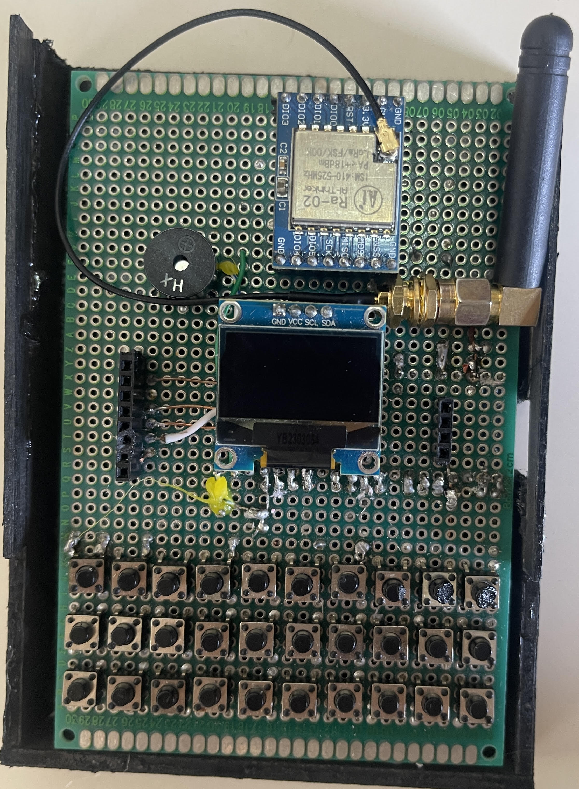
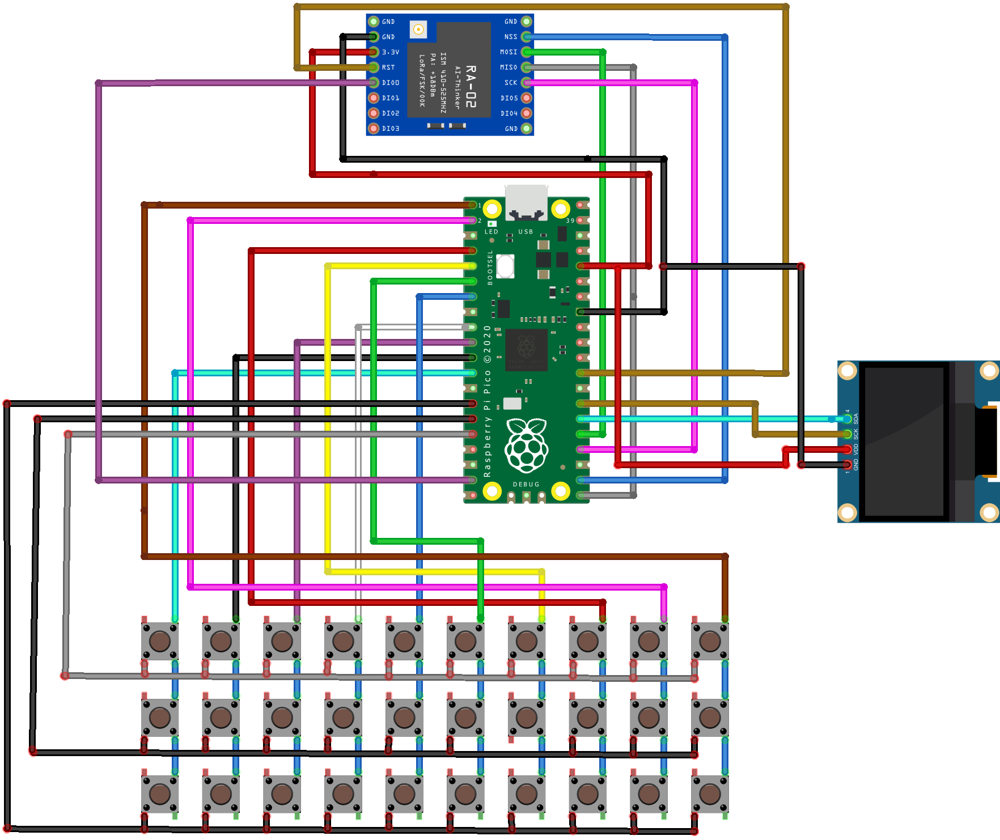
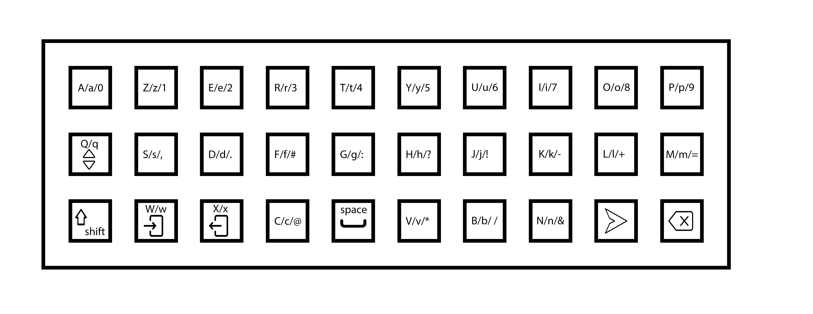

# LoRa Messaging System

> **This project is a collaborative effort with [RanPewd](https://github.com/Raniahafid)**

## ⚠️ Warning

**This project uses the 433 MHz band for communication. Be mindful of local regulations on frequency usage.**

This project is a LoRa-based messaging system built using the Arduino programming language, featuring the RP2040 microcontroller, the LoRa RA-02 transmitter-receiver module, a 0.96" OLED display, and a push-button matrix.

In this repository, you will find the circuit schematic and code required to implement this project.

## Key Mapping

Below is the layout of the button matrix, indicating the positions and functions of each button for message navigation and entry.

## Project Overview

The LoRa Messaging System consists of two terminals that communicate with each other over the LoRa technology at a transmission/reception frequency of 433 MHz. The system is controlled by an RP2040 microcontroller, with each terminal featuring a 0.96" OLED display for information display and an RA-02 LoRa module with a 433 MHz antenna for communication.

## Script Explanation

The main file is **LORA_MESSENGER.ino**. Another file, **keyboard.h**, is used to handle the push-button matrix as a keyboard. Create a folder named **LORA_MESSENGER** and place all files inside it. Open **LORA_MESSENGER.ino** to access the complete project.

The program starts by declaring the necessary libraries, including:
- `<Wire.h>` for I2C communication.
- `<Adafruit_GFX.h>` and `<Adafruit_SSD1306.h>` for OLED control.
- `<LoRa.h>` and `<SPI.h>` for managing LoRa communication.

Next, variables are declared, and the display and LoRa modules are initialized.

The program first displays a welcome screen and the main menu. The menu allows the user to choose between reading messages and writing messages.

- If the user presses the "/f" button, they can navigate through the menu.
- Pressing the "/v" button twice allows the user to select either the "Read Messages" or "Write Messages" option.

**Read Messages**: When this option is selected, the program enters the reception loop and waits for an incoming message. When a message is received, it will be displayed on the OLED screen.

**Write Messages**: If this option is chosen, the program enters the transmission loop, where it accesses the keyboard for message composition. 
  - Pressing the "/a" button once switches to the uppercase keyboard.
  - Pressing "/a" twice accesses the lowercase keyboard, while the symbol keyboard is the default.
  - Once the message is composed, it is shown on the OLED screen, and the user can send it by pressing the "/n" button.

To return to the main menu from either the "Read Messages" or "Write Messages" screen, the user simply double-clicks the "/t" button.

## Issue

Currently, each terminal can only receive or send one message at a time. If you have any suggestions for improving this limitation, contributions are welcome!
